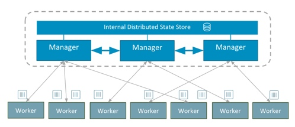

在阿里云ECS上进行Docker1.12.1内置编排实践

## 准备

- Cloud:    阿里云ECS
- Docker:   1.12.1
- Linux:    Ubuntu14.04

### Docker-Machine

- Install Docker Machine & ECS Driver

### ECS-Driver

```
export DEBUG=true 
export ECS_ACCESS_KEY_ID=<您的Access Key ID>
export ECS_ACCESS_KEY_SECRET=<您的Access Key Secret>
export ECS_REGION=cn-shenzhen
export ECS_ZONE=cn-shenzhen-b
export ECS_INSTANCE_TYPE=ecs.s1.small
export ECS_INTERNET_MAX_BANDWIDTH=100
export ECS_SSH_PASSWORD=<ECS实例SSH密码>
export ECS_UPGRADE_KERNEL=true # 2016.09.02
export MACHINE_DOCKER_INSTALL_URL=http://acs-public-mirror.oss-cn-hangzhou.aliyuncs.com/docker-engine/intranet
export ENGINE_REGISTRY_MIRROR=https://6udu7vtl.mirror.aliyuncs.com

```

## 集群



### 创建集群

#### 创建node

```
docker-machine create -d aliyunecs swarm1
docker-machine create -d aliyunecs swarm2
docker-machine create -d aliyunecs swarm3
```

#### 获取manager_ip

```
// 我们使用swarm1作为manager，其他作为普通节点
docker-machine ssh swarm1 ip addr show eth0
```

#### 初始化集群

```
// 用swarm1的内网ip地址作为advertize-addr,将其他node join到这个swarm集群
docker-machine ssh node1 docker swarm init --advertise-addr <NODE1_IP>
docker-machine ssh swarm2 docker swarm join --token <WORKER_TOKEN> <NODE1_IP>:2377
docker-machine ssh swarm3 docker swarm join --token <WORKER_TOKEN> <NODE1_IP>:2377
```

#### 更新内核

```
// 创建服务处解释为什么要更新内核
// 环境变量更新后，ecs创建机器不需要执行下面的操作了：ECS_UPGRADE_KERNEL=true
docker-machine ssh swarm1 apt-get install linux-generic-lts-vivid
docker-machine ssh swarm2 apt-get install linux-generic-lts-vivid
docker-machine ssh swarm3 apt-get install linux-generic-lts-vivid
```

### 管理集群

#### 节点信息

```
// 在swarm1上执行如下命令可以看到该集群的节点信息
thonatos@mbp:~# docker-machine ssh swarm1
root@swarm1:~# docker node ls

ID                           HOSTNAME  STATUS  AVAILABILITY  MANAGER STATUS
2nv11rxhj6dldoz4xq8c47qv1 *  swarm1    Ready   Active        Leader
9iytcdny1vblkh8yc51kymqii    swarm2    Ready   Active
aja48uhn7o4bntybj3yoml4ed    swarm3    Ready   Active
```

#### 创建服务

```
docker service create --name nginx -p 80:80 nginx

// -p 失败，并提示如下
// could not add veth pair inside the network sandbox: could not find an appropriate master "bridged563c27" for "vethac2aa6d"
// "默认的ingress network的overlay网段会和ECS冲突，导致创建有问题"
// "用大于3.16的内核能解决的原因是:支持vxlan interface加到netns中"
// 所以我们在之前更新内核到: 3.19.0-69-generic
```

#### 动态扩容

```
// docker service scale {SERVICE}={REPLICAS}

root@swarm1:~# docker service scale nginx=3
nginx scaled to 3

root@swarm1:~# docker service scale nginx=1
nginx scaled to 1
```

#### 查看信息

```
// 可以看到nginx服务的详细信息
root@swarm1:~# docker service inspect nginx
[
    {
        "ID": "aujbgws6na10pu8h5xl06b9y6",
        "Version": {
            "Index": 1032
        },
        "CreatedAt": "2016-09-01T02:44:49.079793057Z",
        "UpdatedAt": "2016-09-01T04:02:17.312739541Z",
        "Spec": {
            "Name": "nginx",
            "TaskTemplate": {
                "ContainerSpec": {
                    "Image": "nginx:1.9.15-alpine"
                },
                "Resources": {
                    "Limits": {},
                    "Reservations": {}
                },
                "RestartPolicy": {
                    "Condition": "any",
                    "MaxAttempts": 0
                },
                "Placement": {}
            },
            "Mode": {
                "Replicated": {
                    "Replicas": 1
                }
            },
            "UpdateConfig": {
                "Parallelism": 1,
                "Delay": 5000000000,
                "FailureAction": "pause"
            },
            "EndpointSpec": {
                "Mode": "vip",
                "Ports": [
                    {
                        "Protocol": "tcp",
                        "TargetPort": 80,
                        "PublishedPort": 80
                    }
                ]
            }
        },
        "Endpoint": {
            "Spec": {
                "Mode": "vip",
                "Ports": [
                    {
                        "Protocol": "tcp",
                        "TargetPort": 80,
                        "PublishedPort": 80
                    }
                ]
            },
            "Ports": [
                {
                    "Protocol": "tcp",
                    "TargetPort": 80,
                    "PublishedPort": 80
                }
            ],
            "VirtualIPs": [
                {
                    "NetworkID": "1w6bcasgzb38xwbit1eet3xm3",
                    "Addr": "10.255.0.2/16"
                }
            ]
        },
        "UpdateStatus": {
            "StartedAt": "0001-01-01T00:00:00Z",
            "CompletedAt": "0001-01-01T00:00:00Z"
        }
    }
]
```

#### 动态信息

```
// 为了看到集群内的容器更新状态，执行如下命令后我们再对nginx服务进行扩容操作，可以看到变化嘻嘻
watch -n1 "docker service ps nginx | grep -v Shutdown.*Shutdown"
```

#### 动态更新

```
// 这里添加了两个参数进行测试，每次更新一个容器（我们应该保证至少还有一个容器是运行的，否则将会负载将无法正确处理请求），间隔时间是5秒，即可以做到不停机更新
root@swarm1:~# docker service update nginx --update-parallelism 1 --update-delay 5s --image nginx:1.9.15-alpine

// 更新帮助
Usage: 	docker service update [OPTIONS] SERVICE
Update a service
Options:
      --args string                    Service command args
      --constraint-add value           Add or update placement constraints (default [])
      --constraint-rm value            Remove a constraint (default [])
      --container-label-add value      Add or update container labels (default [])
      --container-label-rm value       Remove a container label by its key (default [])
      --endpoint-mode string           Endpoint mode (vip or dnsrr)
      --env-add value                  Add or update environment variables (default [])
      --env-rm value                   Remove an environment variable (default [])
      --help                           Print usage
      --image string                   Service image tag
      --label-add value                Add or update service labels (default [])
      --label-rm value                 Remove a label by its key (default [])
      --limit-cpu value                Limit CPUs (default 0.000)
      --limit-memory value             Limit Memory (default 0 B)
      --log-driver string              Logging driver for service
      --log-opt value                  Logging driver options (default [])
      --mount-add value                Add or update a mount on a service
      --mount-rm value                 Remove a mount by its target path (default [])
      --name string                    Service name
      --publish-add value              Add or update a published port (default [])
      --publish-rm value               Remove a published port by its target port (default [])
      --replicas value                 Number of tasks (default none)
      --reserve-cpu value              Reserve CPUs (default 0.000)
      --reserve-memory value           Reserve Memory (default 0 B)
      --restart-condition string       Restart when condition is met (none, on-failure, or any)
      --restart-delay value            Delay between restart attempts (default none)
      --restart-max-attempts value     Maximum number of restarts before giving up (default none)
      --restart-window value           Window used to evaluate the restart policy (default none)
      --stop-grace-period value        Time to wait before force killing a container (default none)
      --update-delay duration          Delay between updates
      --update-failure-action string   Action on update failure (pause|continue) (default "pause")
      --update-parallelism uint        Maximum number of tasks updated simultaneously (0 to update all at once) (default 1)
  -u, --user string                    Username or UID
      --with-registry-auth             Send registry authentication details to swarm agents
  -w, --workdir string                 Working directory inside the container
```

## 参考

- [Docker Machine和阿里云ECS Driver](https://help.aliyun.com/document_detail/26088.html?spm=5176.100239.blogcont55973.13.opYbg4)
- [Aliyun Elastic Compute Service](https://github.com/denverdino/machine/blob/master/docs/drivers/aliyun.md?spm=5176.doc26088.2.9.tyf2HB&file=aliyun.md)
- [Service scale - Docker documents](https://docs.docker.com/engine/reference/commandline/service_scale/)
- [Service update - Docker documents](https://docs.docker.com/engine/reference/commandline/service_update/)