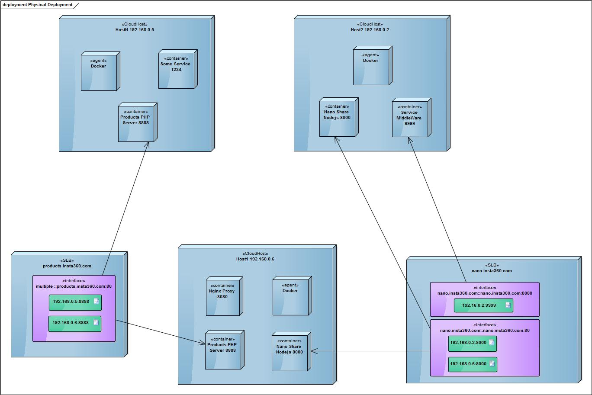
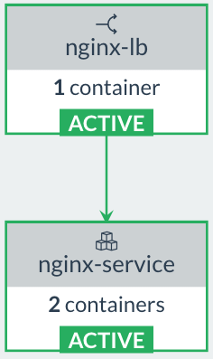

基于Docker的私有云&混合云构建方案

## #what

> Docker是一个开源的引擎，可以轻松的为任何应用创建一个轻量级的、可移植的、自给自足的容器。开发者在笔记本上编译测试通过的容器可以批量地在生产环境中部署，包括VMs（虚拟机）、bare metal、OpenStack 集群和其他的基础应用平台。

DevOps近年大热，Docker也被各大云服务提供商广泛支持，他的应用场景如下且不止于此：

- web应用的自动化打包和发布
- 自动化测试和持续集成、发布
- 在服务型环境中部署和调整数据库或其他的后台应用
- 从头编译或者扩展现有的OpenShift或Cloud Foundry平台来搭建自己的PaaS环境

比如显著的优点有资源独立&隔离、环境的一致性、轻量化、当然了，还有一个大家都想要的特性："Build Once, Run Everywhere"。

## #why

可是作为一家初创公司，为什么我们要构建所谓的"私有云&混合云"？

作为一个实用主义，上述的特性或者说应用场景，最能够吸引我的大概只有"Build Once, Run Everywhere"，然后这仍然不足以成为要推动该方案落地的动力，why？

我们可能以及未来要应对的需求主要有以下几点：

- 快速扩容（应对可能出现的高并发需求）
- 快速减容（媒体相关的内容具有时效性，社交类信息存在访问高峰与低谷）
- 动态迁移（不停机更新、实时迁移服务，备份，容灾等）
- 统一入口（单一或者相对固定的入口，后端服务的迁移不再影响前端业务）
- 持续集成（包含测试，上线，回滚等功能）

应对上述的需求，其实完全可以找到对应的替代方案：

- 动态扩容——使用Aliyun或者Amazon的AutoScale类服务，自动控制服务器数量
- 动态迁移——使用中间件如nginx，upstream不停机更新
- 统一入口——Route53或者ELB/SLB做端口转发，负载均衡后端再次使用VPC内网转发
- 持续集成——使用Jenkins&Webhook搭建自动化平台、或者使用Webhook与应用中心，程序注册为应用中心应用，动态监测，自动更新

但是，看看上面的内容就可以了解到，对初创公司而言，要做这些事情，并不简单，没有那么多的人力物力去做，但是，业务在这里，我们不可能不做，怎么办？

<!--more-->

## #how

这里我们开始今天的主题：

> 基于Docker的私有云&混合云构建方案

基于该主题，我们要先理清一些Docker相关的概念并就该方面会遇到的问题做一些解答

### #host/hode

Host/Node即物理服务器或者云服务器，它是一切服务运行的基石，所有的应用&服务都运行其上，包含了：

- Docker Engine （Docker引擎,运行容器）
- App（容器应用，如Web服务）
- Agent（*容器应用，特殊的容器应用，将该Host注册到容易的管理平台）
- Proxy（*容器应用，特殊的容器应用，用来在内网进行转发）

我们的Host使用了Aliyun以及Amazon的云服务器，动态伸缩包含：

- 服务器动态伸缩
- 应用动态伸缩（通过Docker管理服务进行管理）

服务器如何动态伸缩要实现的功能是：

1. 调用API开通/销毁Ecs
2. 记录Ecs信息如：ip/user/passwd/region/info(配置信息)
3. 注册Ecs到管理平台

### #container

container即运行的服务或者应用，如nodejs的前端应用、php的后端服务、python的媒体处理等，当然还可以包括mongodb/mysql/redis等数据服务

1. 开发，采用ansible docker或者各自环境的官方repo对不同运行环境的应用进行容器化，其实比较简单，针对不同的运行环境在项目里加入一个dockerfile即可，并不需要开发者做过多的配置
2. 构建，这里我们有多种选择（使用Aliyun或者Daocloud的自动构建，在内网配置机器自行构建也可以，方案较多，省时省力的方式自然是使用第三方服务了）
3. 测试，可以选择在dockerfile中执行test或者在推送到test分支，并部署到test服务器，人肉测试，按需选择
4. CI，CI这里我们可以注册gitlab的runner或者是直接使用daocloud的CI，按需选择

### #elb/slb

集群处理上，我们选择在同一个region内，使用一个slb/elb做负载均衡，其他服务器不开通外网服务，在内部针对一组应用配合一个nginx或者haproxy成为一个服务/应用单元，多个这样的单元成为一个当前可用区的内部服务，通过负载均衡拥有统一的入口

```
	slb/elb:
		80:80		{frontend service} -- 应用单元	
					{frontend service} -- host_x0
						nginx:80
							host_x0_1
							host_x0_2
							...		
		8080:8080	{backend  service} -- 服务单元	
					{backend service} -- host_x1
						nginx:80
							host_x1_1
							host_x2_1
							...			
```

### #dns/cdn

基于region构建集群，仍然不能完美解决跨区域的入口统一问题，所以这时候我们有两种方案可选：

1. 基于dns的负载均衡，可使用dnspod，添加多个记录，对应到同一个域名的不同加速域名
2. 基于cdn的方案，则是添加多个回源ip，但是注意一下，该ip，是slb/elb的ip

### #architect



## #practice

这里我们使用rancher作为docker host的管理中心，在每一个host上运行一个rancher-agent与rancher-server进行通讯，并以此来完成基于应用的快速伸缩，当然，我们的服务中不包含data-service，也不包含storage-service，我们使用阿里云的oss作为存储服务，使用rds作为数据库，将更多精力放在开发以及业务上

### #环境：

- 云上主机：阿里云Ecs/亚马逊Ec2（Ubuntu14.10/Centos7.x）
- 负载均衡：阿里云负载均衡器
- 容器管理：rancher-server

### #配置

- Host都已经预装了docker-engine，并且在杭州可用区B
- Rancher-server安装在该区域内的一台独立主机上，具有外网访问ip，该机器暂时不使用负载均衡（后期会用）

### #运行

- rancher-server

	```
	docker run -d --restart=always -p 8080:8080 rancher/server
	```
	
- rancher-agent(add  hosts)

	```
	docker run -d --privileged -v /var/run/docker.sock:/var/run/docker.sock -v /var/lib/rancher:/var/lib/rancher rancher/agent:v1.0.1 {Server_Domain}:{Server_Port}/v1/scripts/{registrationToken}	
	```	

### #管理

一段时间后就看到在rancher-server的控制台里看到有如下机器：


此时Stacks中创建一个Nginx-Test的Stack,创建一个Service（包含多个nginx的container），创建一个load balancer


其结构如下：



并能够根据需求动态伸缩应用数量：


最后，我们需要将load balancer配置为elb/slb服务的后端，并最终将服务暴露到外网。

## #more

- [http://docs.daocloud.io/](http://docs.daocloud.io/)
- [http://docs.rancher.com/](http://docs.rancher.com/)
- [container-as-a-service-0x00](http://blog.thonatos.com/container-as-a-service-0x00/)