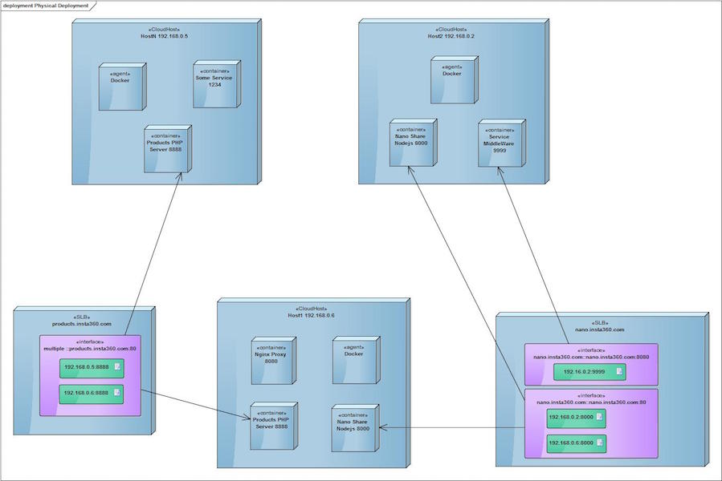
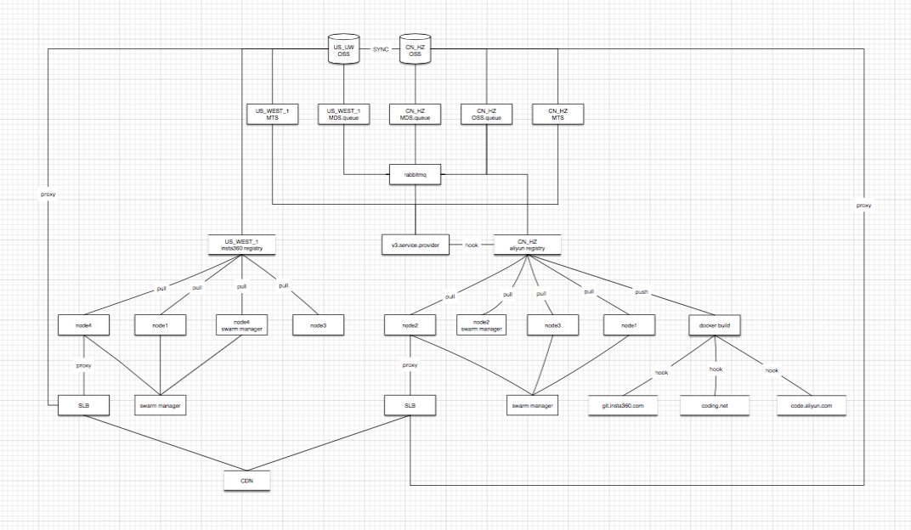
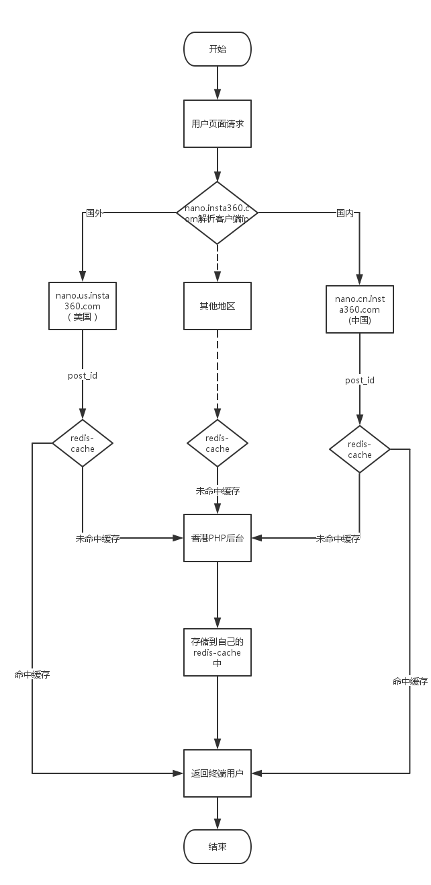
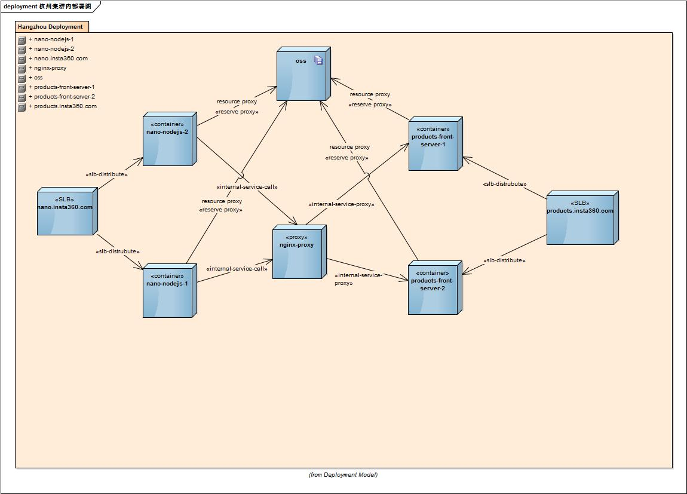
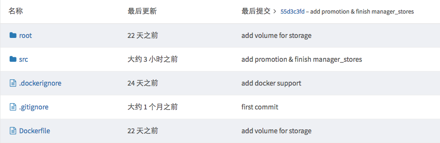
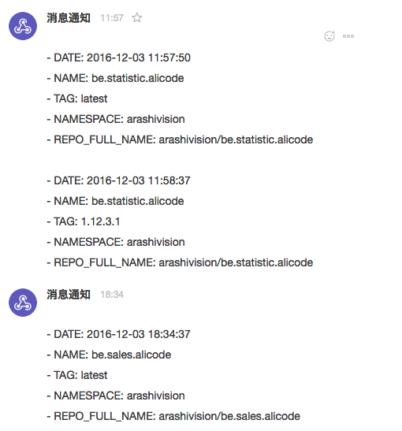
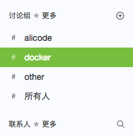
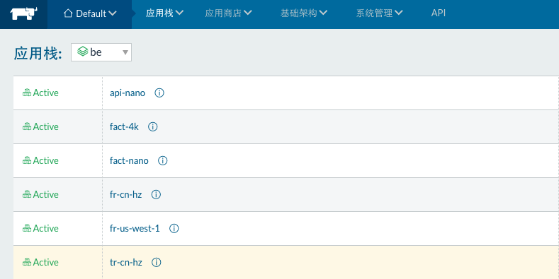

作为一个全景/VR创业公司，随着公司人员增加以及全球化方向转变，刀耕火种的CI/CD方式已经不能满足当前的需求。综合考虑当前的人员状况与技术架构的拓展性后，我们采用一套以阿里云为基础，Docker为核心，第三方服务为工具的开发、测试、部署流程，以及内部的代码提交，版本管理规范。

## 作者

> 苏依（杨贺强）
> 
> 高级前端工程师兼Web组技术负责人，专职前端技术选型与架构设计。
> 
> 就职于Insta360（全球360°全景相机（VR相机）全景领跑品牌，深圳岚锋创视网络科技有限公司）

## 背景

我司是一家集硬件研发与软件开发为一体的互联网创业公司。2016被称为全景/VR元年，预示了机遇到来的同时，也注定了我们将会面临一些列前所未有的问题，其中坑点无数，但不在本文讨论范围呢，废话不多说，我们直奔主题。

我司目前对用户开放的业务为主要包含以下三块：

1. 视频图片分享（2C）
2. 全景 / VR直播（2B）
3. 新闻媒体合作（2B）

其中视频图像分享针对C端用户，用户遍布全球，要求各地用户都能够方便快速分享，同时也要求较好的浏览体验，由于点对点分享的特性，该部分流量正常情况不会太大；但是新闻媒体又扮演了特殊角色，例如11月25日，由于凤凰网首页嵌入我司分享页，从8:00至9:30期间，持续一小时多的(n)Gbps流量&以及每秒(n)K请求数几乎扮演了DDOS身份，瞬间拖垮后端统计服务器，导致普通用户完全无法访问。同理，全景 / VR直播目前虽然为测试功能，但仍存在潜在风险。故而要求我司能够建立快速的相应机制，以及可用预备方案。

## 挑战

面临的挑战简单罗列如下：

- 集群化部署	
- 差异化部署
- 全球化部署
- 环境差异大
- 资源利用率低
- 项目数量&语言增加

具体到各个内容本身，首先我们需要前端服务器在各个region集群化部署，分摊访问压力，同时集群内在某些情况下需要同时提供线上测试环境（不同于常规的测试环境，是完全等同于正式环境的测试版），从而需要差异化部署能力支持。

其次，由于我司全球化战略，业务不光要考虑国内用户，同时也要为海外用户提供一致的体验，故而要求全球化部署。

环境差异大，是指采用前后端分离的方式进行开发后，前端及Web服务包含redis+nodejs环境，后端同时存在php+java+python+c等，传统方式部署已经无法满足快速响应的需求，采用ansible虽然能够满足需求，但配置繁琐，故而也被放弃。

同时，考虑业务的拓展性，单机部署上述各种环境时，需要预留一定资源作储备，防止突发情况；即使采用镜像的方式对当前环境进行打包，在遇到突发情况时，还原依然需要较长时间，响应速度太慢；综合前几点考虑，采用了保证稳定性与可用性，降低资源利用率低的方式。

最后不得不说的是，从最初的几个项目到如今的几十个项目（日常更新10~20），如果继续按照以往的方式，则只能专人专职负责部署业务。对于一家创业公司来说，将更多的精力用于开发新功能与为用户提供更优体验，显然更为重要。综上所述，所有问题都要求我们转变原始的CI/CD方式，采用一种更加轻量，更加简单的方案势在必行

## 方案

- ssh/fabric
- ansible
- docker

ssh/fabric是我最初尝试的方案，但是需要进行一些列的开发，基本在实验阶段就被放弃；ansible固然强大，但是也依然不利用上述挑战的解决，主要问题如下：

1. 配置繁琐
2. 扩展性差（相对而言）
3. 可靠性差（使用ssh方式，受网络影响大）

而Docker也就是在此时成为可选方案之一，其优势不言而喻：

1. 灵活 将应用于系统容器化，不需要额外依赖
2. 便捷 任意linux发行版配置docker engine即可启动
3. 开源&免费 开源/免费低成本，linux内核驱动
4. 轻量 仅需添加或减小镜像即可，在一台服务器上可以布署多个容器
5. 环境一致性 镜像本身即包含运行环境，避免由于环境不一致带来的各种异常与风险

## 架构/容器化

### 第一代架构

- ssh
- fabric/ansible

刀耕火种的ssh方案与docker实验阶段，目前已经全面弃用。

### 第二代架构

1. 使用阿里云VPC，内部使用ansible管理服务器
2. 通过ansible运行docker命令进行容器进行部署
3. 后端服务&rabbitmq，依然使用传统方式部署

### 第三代架构

第三代架构仍处于完善阶段，上图简单描述了我司三个region服务于应用的分布：

- 杭州/美西
	- 前端服务
	- 数据存储
	- 镜像仓库
	- 图像处理/视频转码 worker
	- 配置服务 redis slave
		- 服务ip地址
		- 服务域名信息
		- 服务配置信息
- 香港
	- 数据中心（数据库）
	- 中间件（第三方服务）
	- 统计系统
	- 消息队列
	- 配置服务 redis master

#### 前端服务

其中前端服务为主要为浏览服务，由cdn + slb + (nodejs+redis) 组成:

用户访问域名后通过dns-load-balancer进行第一次负载，解析到cdn的不同cname，cdn判断请求类型：

1. 资源 mp4/mp3/jpg/png返回客户端
2. 请求转发到slb，slb通过加权轮训方式进行二次负载
3. 请求到达前端服务器(nodejs)，通过内部redis集区获取数据
4. 数据存在则返回，不存在则请求数据中心并缓存，再返回客户端
5. 作为cdn源站，通过nginx/haproxy反向代理oss，走阿里云内网对外提供媒体资源

#### 数据存储

我司业务目前分为两类：

- oss 使用aliyun oss存储服务，存储媒体资源如视频与图片
- volume，使用阿里云ossfs搭建的docker volume，存放持久化数据

#### 图像处理

视频处理目前使用了阿里云mts转码服务做普通视频视频转码，同时，由于行业特殊性，需要对全景视频和图像进行一些列处理，由python+celery+c配置的worker处理，该部分内容由香港数据中心的rabbitmq进行统一管理，消息到达rabbitmq后自动进行分发，由空闲的worker处理并通过mq返回结果（之前也有尝试过http方式进行返回，但由于网络环境较为恶劣，可能出现http请求无法达到，自行处理错误逻辑较为麻烦，因而使用mq，设置一定过期时间，如果无法获取结果，则重新发送任务），当前架构的优化版本mq已经由kafka代替。

kafka在内存占用上，大大超出rabbitmq，单机部署rabbitmq，当queue数量达到1w左右则开始出现无法继续处理的情况，同配置机器安装kafka，测试期间100w左右任务，内存状况依然完好。

#### 配置服务

配置服务其实是简单的redis主从，主要功能是维护一些配置信息，如服务的ip地址（实测结果中，海外各类运营商dns解析有严重问题，故而放弃域名使用ip）；服务的配置信息，如服务名称，前端服务请求数据结果变更等；使用redis的原因也是一样，能够自我维护状态的，尽量放弃人工干预，因为该部分占用资源较小，master做持久化，slave直接运行即可，使用alpine镜像，仅仅10m左右。

#### 数据中心

该部分的数据为数据库存储的数据：

1. Aliyun RDS （以后业务量增加后可以考虑过渡到DRDS）
2. Aliyun Mongodb

#### 任务队列/消息队列

- rabbitmq
- zookeeper 集群
- kafka （目前单机，存储使用ossfs）

## 规范/流程

### 开发

#### 项目结构：

- Dockerfile
- src放置项目代码
- root存放docker配置信息，覆盖容器内部系统配置

#### 代码提交

- 分支/branch
	- dev 	开发分支，构建开发镜像（本地构建测试）
	- test 	测试分支，用于构建线上测试镜像
	- master 主分支，构建latest镜像
- 版本/tag 
	- 规则：release-v{version}.{month}.{date}.{order}
	- 示例：release-v5.12.05.02  

这里的版本参考了阿里云镜像服务的自动构建规则。

### 构建

构建服务目前我们有总体包含三套：

- Aliyun 镜像服务，自动构建，用于正式环境的镜像发布
- CircleCi，自动构建与测试，用于github项目的自动构建
- DroneCI，用于内部构建，主要用于内网的自动构建与测试

构建成功后使用webhook推送到Bearychat通知Web组成员:

hook接口处理会返回：

- 时间
- 名称
- 版本
- 命名空间
- 镜像全名

### 测试

Hook服务收到信息后，根据tag判断应该发送到Bearychat的何种分组：

测试组成员收到提示后，与开发确认测试要点后，可登录内部测试平台(使用rancher搭建)，选择对应的应用测试，并反馈结果给产品&项目经理，通过则验收完成。

### 部署

开发打Tag并推送到阿里云镜像服务，镜像构建完成后Hook系统根据Tag调用Api进行自动部署（阿里云服务目前未使用api，为控制风险，仍然采用人工更新的方式）

## 思考

1.如何进一步完善工作流？

> 完善更多自动化服务，进一步减少人工交流成本如：开发提交后，自动获取git commit信息，并发送到测试组。

2.其他

## QA

Q：请问为什么不直接使用阿里云提供的容器服务？
> 这个原因也是因为全球化目标，当时阿里云的服务还不够完善，美西和香港还没有节点；香港至今仍然没有，所以我们香港数据中心是使用rancher自行搭建的。

Q: 有用jenkins 吗
> 没有，我司nodejs和python是重度服务，我们在github上做了一些基础的镜像包，项目内直接引用就好

Q：请问生产环境使用docker部署的话。在性能方面有什么要注意的么？业界很多人都对docker的网络比较诟病
> 这个问题要好好回答一下（因为最近刚被坑过..）
> 
> 1. 网络部分，overlay 我们放弃了，其中一个很重要的原因是无法获取真实ip，同时也发现在达到一定数量级的时候，访问速度变慢，具体的测试结果后面会发出来。
> 
> 2. 性能，目前发现的，是rabbitmq性能比较差；我司nodejs比较重，nodejs在前端服务上的性能还是值得信赖的，刚才的例子里说过凤凰的事情，后端完全挂起，前端因为redis的存在，完全没有出现异常。

Q: Docker swarm 呢
> swarm目前只在内部网络进行测试，还没正式大规模部署，比如无法获取ip的问题，就直接被pass了

Q: 请问您对于容器日志和业务日志是如何收集的？采用什么方案？
> 日志我们目前有主要有两种：第一种是阿里云容器服务的日志，是通过api导出，然后在私有的elk上进行分析；另外一部分是容器的日志，这里我们是用了kafka，elk进一步从kafka获取日志，然后处理并返回统计系统

Q: Grunt 构建是打入镜像 还是在容器启动时运行
> 完全没有用到，nodejs项目是基于webpack进行打包的，在项目发布的时候会进行一次编译，然后node_modules+static_res一起放在镜像内

Q: 不使用overlay的话。用路由规则么？还是？
> 我们云服务以阿里云和aws为主，其中阿里云服务器使用slb进行负载，这里要说的是，我们是通过给应用本身加上数字标签，例如a服务是80，则使用8080表示其使用80端口；b是81，8180同理

Q：看到分享的同事在用rancher做测试环境，如果可能的话，可以分享下使用心得吗？
> 稍后我会分享出来，有问题我们可以后续交流

Q: nginx和kafka在线上都采用了容器模式吗？性能如何？谢谢
> kafka是完全使用容器来部署的，刚才有提到过，单容器百万任务完全无压力；nginx的话，我们目前cdn回源全部是通过nginx反向代理到oss内网的，nTB静态资源，目前还没有遇到性能问题。

Q：你们是针对源码编译打包并放到景象里么？还是镜像启动的时候到某个存储服务上拉取？
> 我们代码放在git里，在构建的时候去编译和打包，讲编译后的代码放入镜像；后者考虑过，但是网络情况多变，不稳定性太多，建议不要这样做；
> 这里补充一下，为了加快构建速度，我们做了分包处理；例如一个python应用，使用到了PIL，则构建一个基础的python镜像，并编译好PIL；应用以该镜像为基础继添加pkg并启动

Q: 环境变量是在镜像内设置 还是在容器启动时赋值
> 这个看情况，一般情况是容器内部存在默认的环境变量，如不设置则启动默认参数（针对某一region），启动时的环境变量优先级最高，可以覆盖内部环境变量